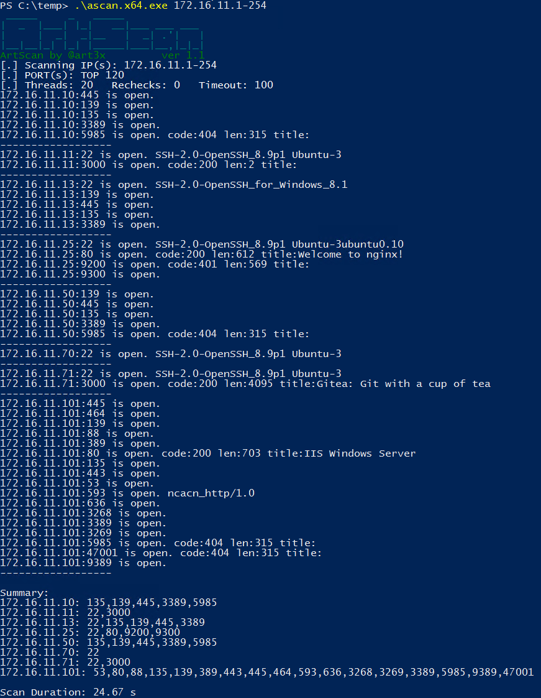

# ArtScan

ArtScan is a multiplatform, tiny, smart, and very fast port scanner written in C. It is perfect for pentesting and red team engagements. Its size is only **25 KB**.



## Features

* IP ranges and port ranges scan with threads and timeout adjustments
* Super fast smart scan of TOP 123 most common ports by default
* Scan progress
* Perform ping scan only (skip port scan)
* Capture banners and HTTP responses on open ports
* Scan by IP and FQDN
* Brief, sorted scan summary

## Usage

```
Usage: <target> [portRange] [options]
  target:    Hostname (e.g., scanme.nmap.org), single IP, or range (192.168.1.1-100)
  portRange: Single port, range (80-90), comma-separated list (22,80,443), or 'all'
Options:
  -T <num>:  Set thread limit (default: 20, max: 50)
  -t <ms>:   Set port scan timeout in msec (default: 100)
  -r <num>:  Set extra rechecks for unanswered ports (default: 0, max: 10)
  -Pn:       Disable ping (skip host discovery)
  -i:        Perform ping scan only (skip port scan)
  -Nb:       Enable hostname resolution via reverse DNS lookup
  -h:        Display this help message
```