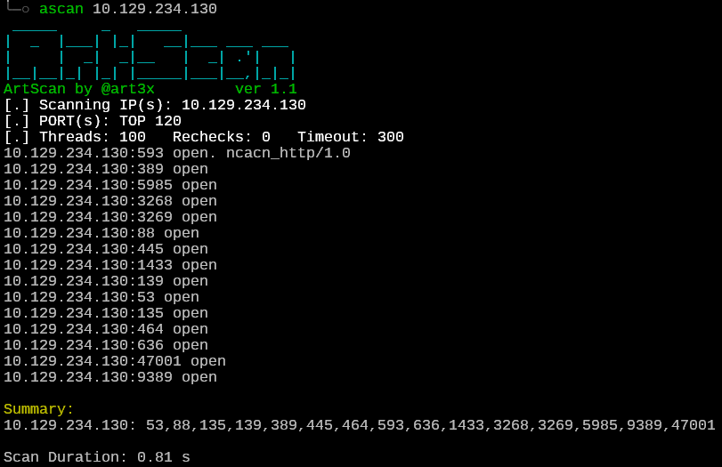

# ArtScan (Linux version 🐧)

ArtScan is a tiny, convenient, and very fast port scanner written in C. It is perfect for pentesting and red team engagements.



## Features

* IP ranges and port ranges scan with threads and timeout adjustments
* Fast smart scan of TOP 123 most common ports (by default)
* Fast smart scan of TOP 57 UDP most common ports
* Scan progress
* Perform ping scan only (skip port scan)
* Capture banners and HTTP responses on open ports
* Scan by IP and FQDN
* Brief, sorted scan summary

## Compile (smaller size but may not working on other systems)
```
gcc -O2 -std=gnu11 -pthread -o ascan ascan.c
```
## Compile static (recommended)
```
musl-gcc -O2 -static ascan.c -o ascan
```

## Usage

```
Usage: ./ascan <target> [ports] [options]
  target:    Hostname (e.g., scanme.nmap.org), single IP, or range (192.168.1.1-100)
  ports:     Single port, range (80-90), comma-separated list (22,80,443), or 'all'
Options:
  -T <num>:  Set thread limit (default: 100)
  -t <ms>:   Set port scan timeout in msec (default: 300)
  -r <num>:  Set extra rechecks for unanswered ports (default: 0)
  -Pn:       Disable ping (skip host discovery)
  -i:        Perform icmp scan only (skip port scan)
  -u:        Perform UDP scan instead of TCP
  -Nb:       Enable hostname resolution via reverse DNS lookup
  -h:        Display this help message

```