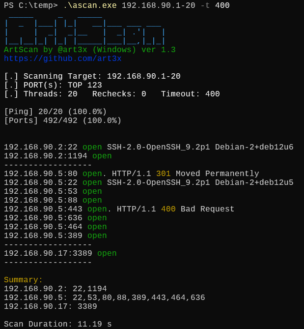

# ArtScan (Windows version 🪟)

ArtScan is a tiny, convenient, and very fast port scanner written in C. It is perfect for pentesting and red team engagements. Its size is only **25 KB**.



## Features

* IP ranges and port ranges scan with threads and timeout adjustments
* Smart scan of TOP 120 most common ports by default
* Perform ping scan only (skip port scan)
* NetBIOS name lookup
* Grab answers and HTTP responses on opened ports
* Scan summary brief

## Usage

```
Usage: <ipRange> [portRange] [-T threadLimit] [-t timeout] [-r rechecks] [-Pn] [-i] [-Nb] [-h]
  ipRange:   Single IP or range (e.g., 192.168.1.1-100 or 192.168.1.1-192.168.1.100)
  portRange: Single port, range (80-90), or comma-separated list (22,80,443)
  -T:        Set thread limit (default: 20, max: 50)
  -t:        Set port scan timeout in msec (default: 100)
  -r:        Set extra rechecks for unanswered ports (default: 0, max: 10)
  -Pn:       Disable ping (skip host availability check)
  -i:        Perform ping scan only (skip port scan)
  -Nb:       Enable hostname resolution during ICMP (like ping -a)
  -h:        Display this help message

```
